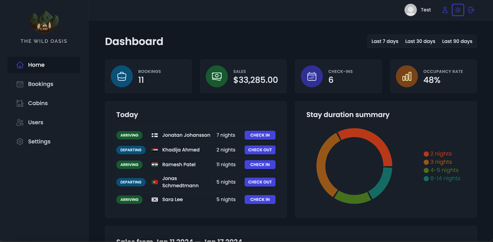
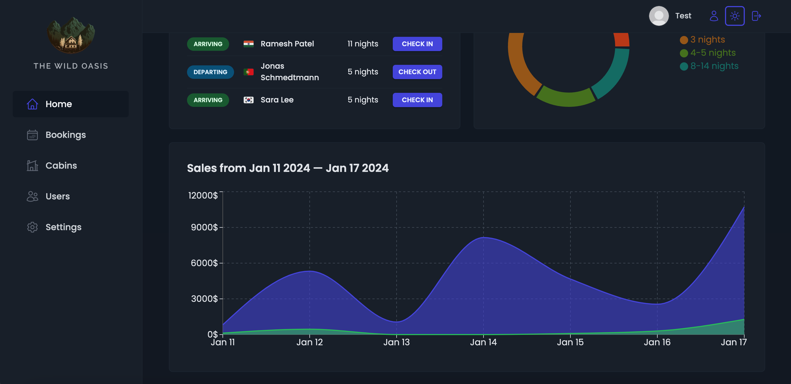
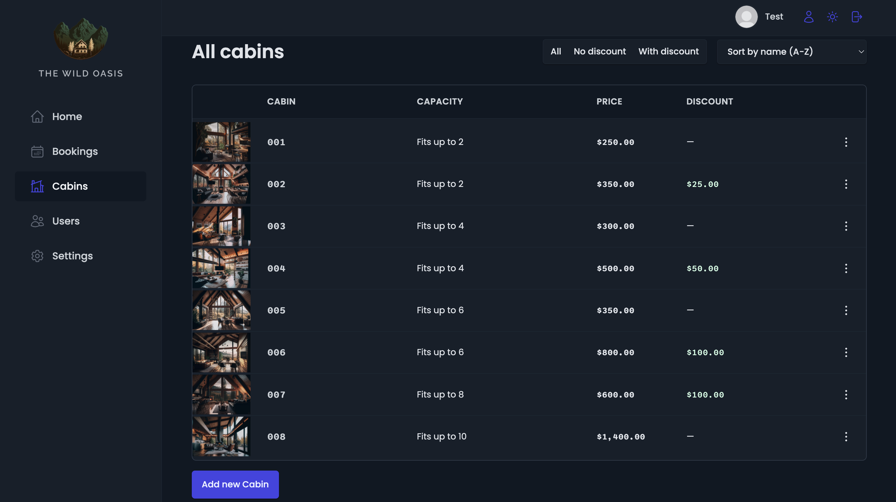
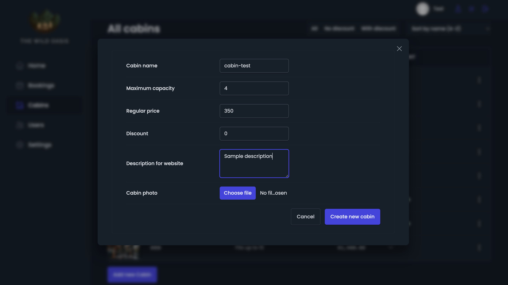
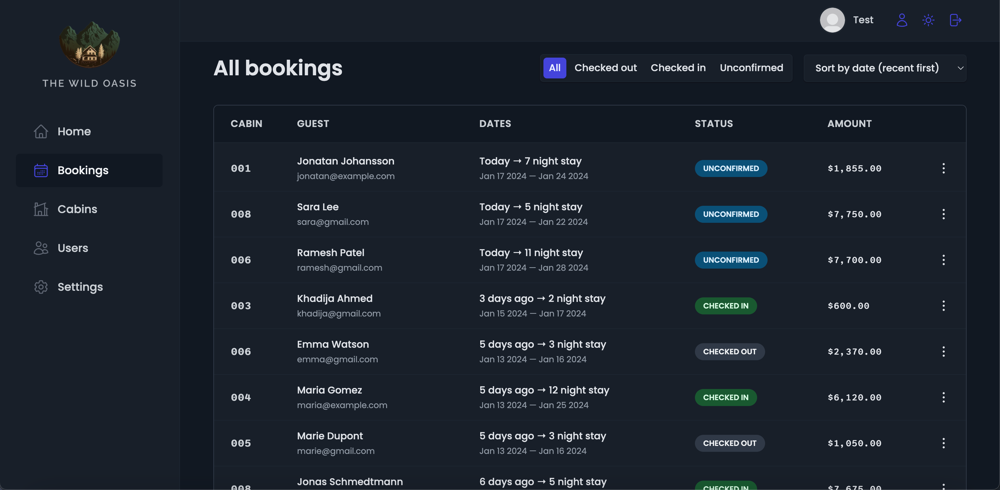
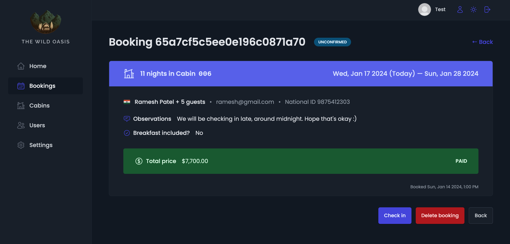
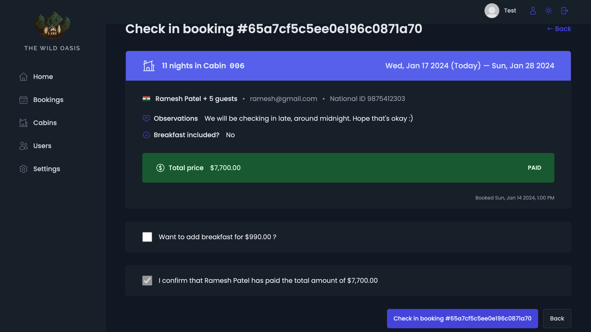
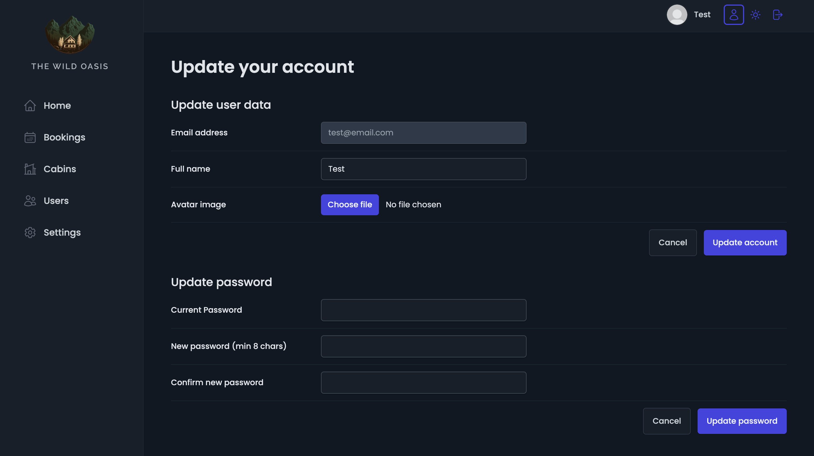
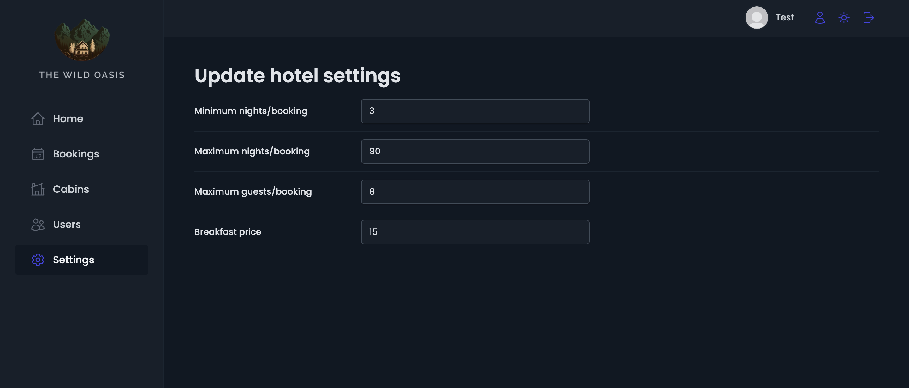

# The Wild Oasis - Hotel Management Dashboard

Welcome to The Wild Oasis, a comprehensive React-based dashboard designed for hotel employees to efficiently manage bookings, cabins, and various hotel settings.

## Features

### 1. Dashboard

- Get real-time statistics on bookings, sales, check-ins, and occupancy rates.
  

- **Today's Bookings**: Stay updated with bookings scheduled for the current day.

- **Charts**: Visualize stay duration summaries and sales trends for specified periods.
  

### 2. Cabins

Manage your cabins by filtering, sorting, and adding new ones.



### 3. Bookings

Easily filter, sort, and view detailed information about bookings.



- **Check-in Booking**:
  Dive into check-in pages for each booking, where you can add optional breakfast and update check-in status.
  

### 3. Update User Account

Manage user account profile by adding an avatar image, or change password.


### 4. Settings

Configure various hotel settings, including min/max nights per booking, maximum guests, and breakfast prices.


### 5. Dark Mode

Enjoy a comfortable browsing experience with our built-in dark mode.

## Libraries Used

- [react-query](https://react-query.tanstack.com/): A React library for managing, caching, and updating asynchronous state.
- [react-hook-form](https://react-hook-form.com/): Performant, flexible, and extensible forms in React.
- [react-toast](https://www.npmjs.com/package/react-toast): A lightweight toast notification library for React.
- [react-router-dom](https://reactrouter.com/web/guides/quick-start): Declarative routing for React.js.
- [recharts](https://recharts.org/): A composable charting library for building charts with React and D3.
- [styled-components](https://styled-components.com/): Visual primitives for the component age in React.

## Backend Repository

For the backend code of The Wild Oasis, check out the [backend repository](https://github.com/arijit-malakar/the-wild-oasis-api).

## Usage

For initial access, use the following default admin credentials:

- **Email**: admin@email.com
- **Password**: pass1234

## Installation

1. Clone the repository:

```bash
git clone https://github.com/arijit-malakar/the-wild-oasis.git
```

2. Install dependencies:

```bash
cd the-wild-oasis
npm install
```

3. Start the development server:

```bash
npm run dev
```
